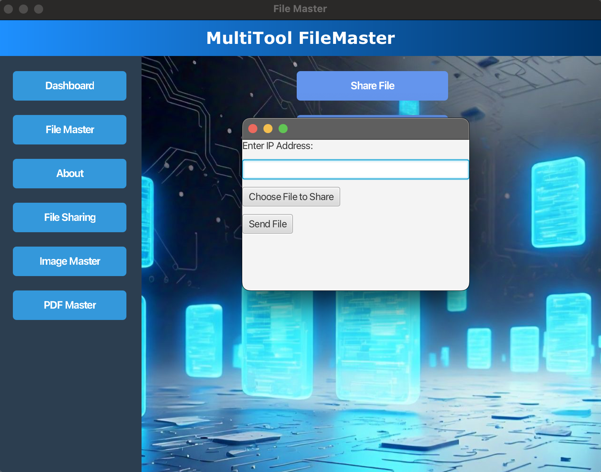

# MultiTool FileMaster

**MultiTool FileMaster** is a powerful and versatile file management application developed in Java, offering a comprehensive suite of features designed to simplify file handling. With the ability to pack, compress, encrypt, decrypt, and share files, this tool serves as a one-stop solution for managing files securely and efficiently. The app also includes advanced features like image and PDF compression, alongside the ability to share files securely over a network.

Designed with a **JavaFX GUI**, MultiTool FileMaster ensures a user-friendly experience while allowing users to seamlessly manage, compress, and share their files and images.

## 🌟 Key Features

- **Packing Files**: Effortlessly pack multiple files into a single compressed archive, reducing file clutter and enhancing portability.
- **Compressing Files**: Compress large files to save space and make them easier to share, with support for a wide range of file types.
- **Encrypting Files**: Protect your sensitive files with **AES encryption**, ensuring they are only accessible to authorized users.
- **Image Compression**: Reduce the size of image files without sacrificing quality, making them easier to upload, store, or share.
- **Decompressing Files**: Uncompress packed files (archives) to retrieve the original content with just a click.
- **Decrypting Files**: Securely decrypt AES-encrypted files and gain access to your data when needed.
- **File Sharing**: Send and receive files between clients using **socket programming**, ensuring easy and secure file transfers across networks.

## ⚙️ Technologies Used

- **Java**: The core programming language for building file management functionalities and operations.
- **JavaFX**: Used to create the graphical user interface (GUI), enabling an intuitive user experience for file and image management.
- **AES Encryption**: Advanced encryption standard (AES) used to ensure the security of files and images by encrypting and decrypting them.
- **Socket Programming**: Implements file sharing capabilities between clients over a network, allowing seamless transfers of files without the need for cloud storage.

## 🖼️ Screenshots

Here are some screenshots showcasing the different features of the MultiTool FileMaster application:

### 1. **Dashboard**

*The main dashboard of MultiTool FileMaster, where you can access all features.*

### 2. **File Management**

*File management interface displaying various file handling options.*

### 3. **Image Compression**

*The image compression window, allowing users to reduce the file size of images while maintaining quality.*

### 4. **PDF Compression**

*Compress PDF files easily with the dedicated PDF compression tool.*

### 5. **Received Files**

*A window showing the list of files that have been received from other clients.*

### 6. **File Sharing Window**

*The file-sharing window, where users can send or receive files across the network.*

### 7. **Shared Files Management**

*Manage and view the files that have been shared between clients.*

## 🚀 How to Use

1. **Clone the repository**:
    ```bash
    git clone https://github.com/yourusername/MultiTool-FileMaster.git
    ```

2. **Setup JavaFX**:
    - Make sure you have **JavaFX** set up on your system. You can download it from [here](https://openjfx.io/).
    - Set up the `PATH_TO_FX` environment variable to point to the **lib** folder in your JavaFX SDK.

3. **Run the Application**:
    - Open a terminal/command prompt and navigate to the project directory.
    - Compile the project:
    ```bash
    javac -cp ".:/path/to/javafx-sdk/lib/*" Main.java
    ```
    - Run the application:
    ```bash
    java -cp ".:/path/to/javafx-sdk/lib/*" Main
    ```

4. **Using the Application**:
    - **Pack Files**: Select multiple files and pack them into one archive for easier management.
    - **Compress Files**: Choose a file and compress it to reduce its size, making it easier to share.
    - **Encrypt Files**: Select a file to encrypt using AES encryption for secure handling.
    - **Image Compression**: Choose an image file, adjust the compression settings, and compress it without losing quality.
    - **File Sharing**: Use the file-sharing feature to send or receive files from other clients on the network.

## 🔧 Future Enhancements

- Add support for additional file formats for compression and encryption.
- Implement a more robust file-sharing system with added features like file versioning and transfer status.
- Introduce enhanced PDF handling and compression tools for improved PDF management.
- Upgrade to a more advanced encryption algorithm for higher security.
- Improve the user interface with additional features such as drag-and-drop functionality and better file navigation.

